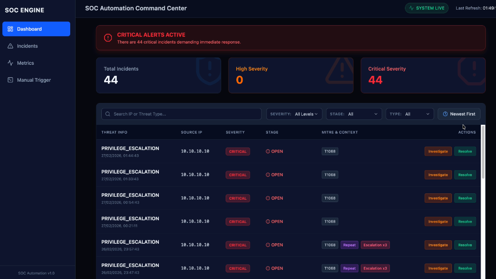
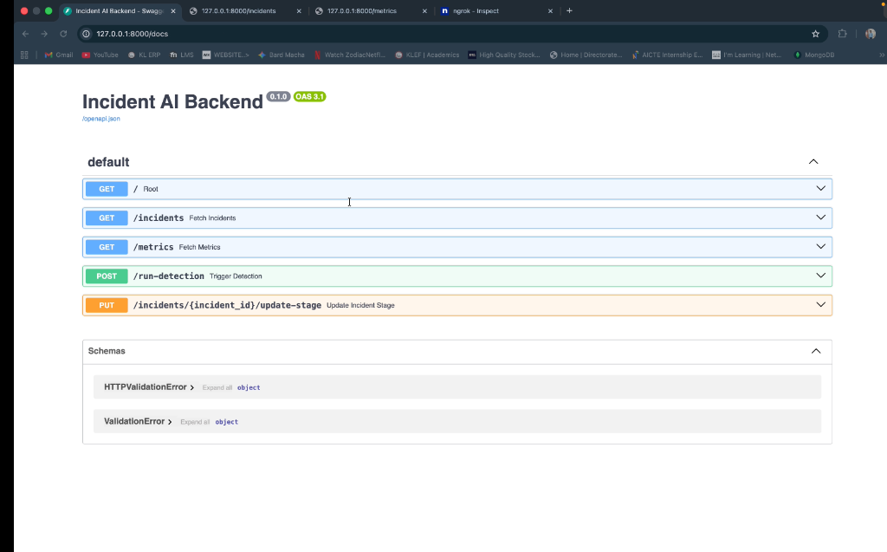
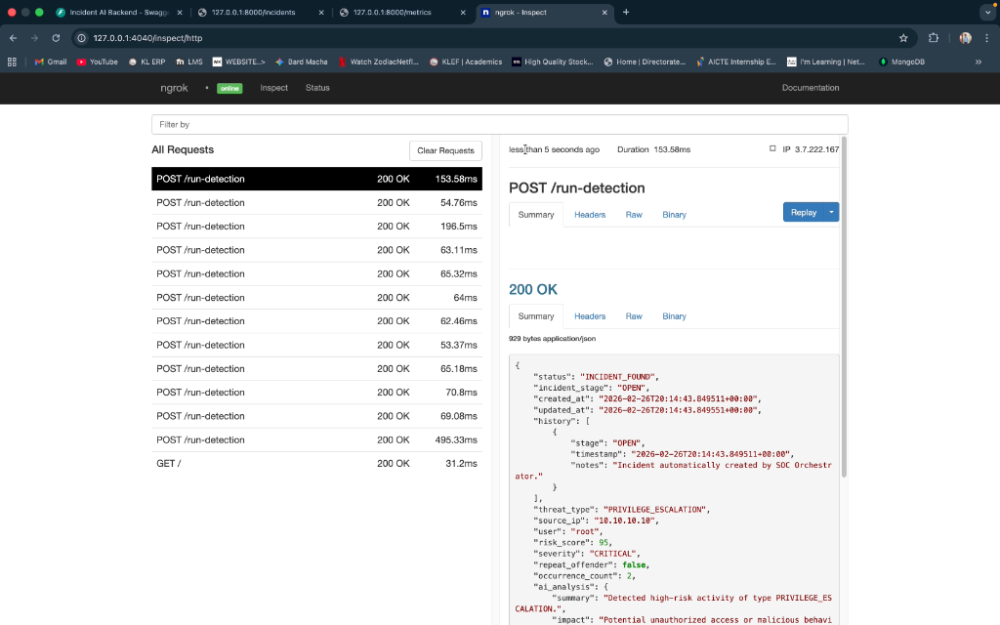
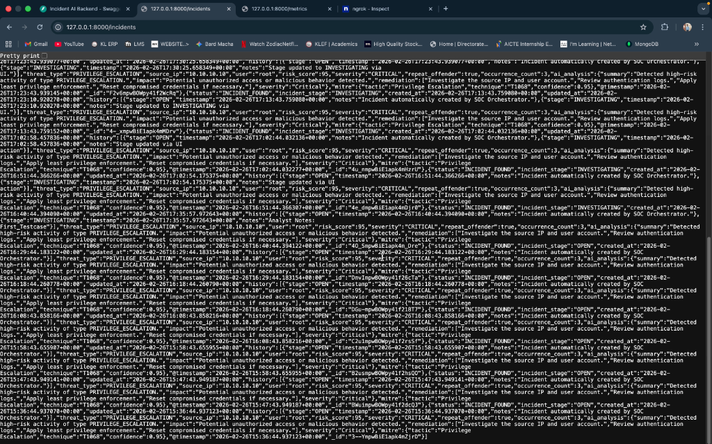
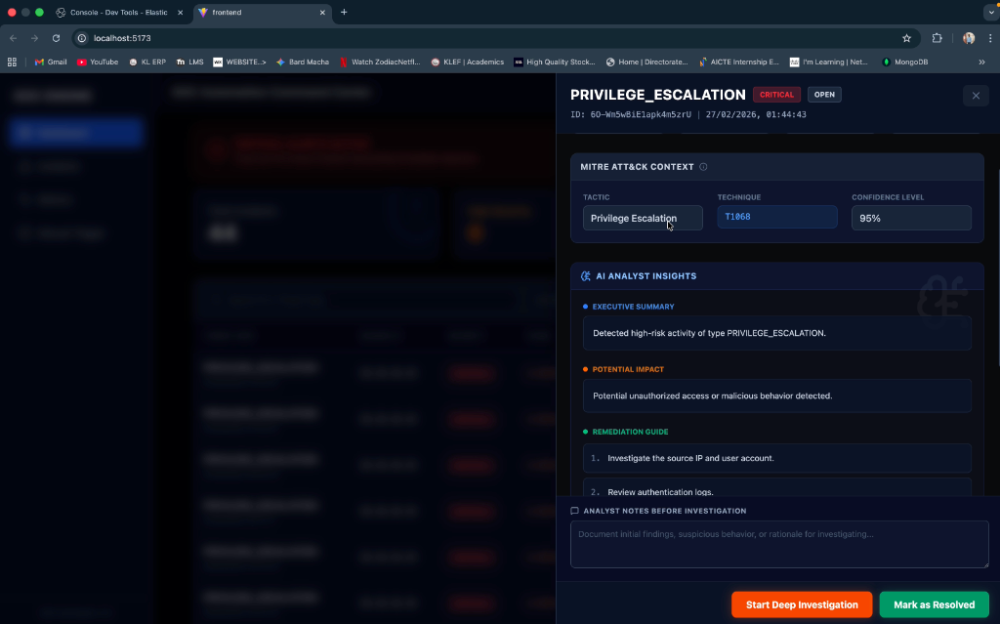

# 🛡️ AI-Driven SOC Orchestration Platform

An enterprise-grade Security Operations Center (SOC) orchestration platform built to automate Level 1 triage, accelerate Level 2 deep investigations, and autonomously generate Level 3 executive closure reports using Elastic Security and Google Gemini AI.

This platform bridges the gap between raw Elasticsearch security telemetry and actionable, AI-enriched incident lifecycles dynamically rendered inside a modern React application.

## ✨ Core Features

The platform operates on a three-tier AI incident lifecycle:

### 🟢 L1: AI Triage & MITRE Enrichment
- Automatically ingests raw security logs triggered by high-risk thresholds (>70).
- Applies **Deduplication** algorithms (preventing repeated alerts within 10-minute windows).
- Instantly maps threat patterns to the **MITRE ATT&CK Framework** (Tactic, Technique, Confidence Level).
- Generates an initial AI Triage summary highlighting immediate impact and remediation steps.
- Escalate incidents to `CRITICAL` natively if repeat-offender thresholds are met.

### 🟣 L2: Deep AI Investigation
- Triggered manually by an Analyst shifting a Threat to `INVESTIGATING`.
- Performs **Deep Analysis** encompassing the original log telemetry, the L1 Triage context, and analyst notes.
- Automatically generates:
  - 🕸️ **Attack Path Analysis**: How the threat is transversing the environment.
  - 🛡️ **Containment Strategy**: Precise, immediate steps to sandbox the threat.
  - ⚠️ **Risk If Ignored**: Executive blast-radius assessment.

### 🟢 L3: Executive Closure Protocol
- Activated upon resolving an incident (`RESOLVED`).
- AI consolidates the entire audit lifecycle safely via atomic Elasticsearch patches into a final `Closure Report`.
- Dynamically outputs:
  - **Executive Summary**
  - **Response Actions Taken**
  - **Residual Risk Analysis**
  - **Lessons Learned**

## 🏗️ Architecture

- **Database / SIEM Engine**: Elasticsearch (Stores raw `security-logs` and enriched `incidents`).
- **AI Inference Pipeline**: Elastic's Inference API (`.google-gemini-2.5-flash-completion`).
- **Backend**: FastAPI (Python) orchestrating incident states using strict Elasticsearch atomic updates.
- **Frontend**: React + Vite, decorated with TailwindCSS & Lucide icons.

## 🚀 Getting Started

### Prerequisites
- Python 3.9+
- Node.js (v18+)
- An active Elasticsearch Cloud instance with Inference Capabilities enabled.

### 1. Environment Setup

Inside the root directory (`incident_ai/`), create a `.env` file containing your Elastic credentials:
```env
ELASTIC_CLOUD_ID=your-cloud-id
ELASTIC_USERNAME=your-username
ELASTIC_PASSWORD=your-password
```

*(Note: The frontend `VITE_API_BASE_URL` is natively tracked via `frontend/.env` and points to `http://127.0.0.1:8000`)*

### 2. Start the Backend

```bash
# Create and activate virtual environment
python3 -m venv venv
source venv/bin/activate

# Install dependencies
pip install -r requirements.txt

# Start the FastAPI Server
cd backend
PYTHONPATH=.. uvicorn main:app --reload --port 8000
```

### 3. Start the Frontend

In a separate terminal:
```bash
cd frontend

# Install Node modules
npm install

# Start the Vite development server
npm run dev
```

Point your browser to `http://localhost:5173`.

## 🎮 Emulating SOC Operations

1. **Trigger the Orchestrator:** Click the **"Manual Detection Orchestrator"** navigation tab and press **Run SOAR Engine Now**. This will simulate an Elastic Watcher ingesting the latest malicious log payload and escalating it.
2. **Review Triage:** On the Dashboard, click the newly generated incident to review the **L1 AI Triage** & **MITRE Matrix**.
3. **Deep Investigation:** Enter initial "Analyst Notes" and click **Start Deep Investigation**. Wait for the engine to yield the purple L2 Deep Analysis module.
4. **Resolution Finalization:** Log any final steps in the notes and click **Mark as Resolved** to immediately generate the final emerald Executive Closure Report.

## 📸 Screenshots

**Frontend Illustration :**


**Fast_Api Interface :**


**Ngrok :**


**logs in Json formate :**


**Our Prediction model :**


## 🔐 Security Constraints Adopted
- No destructive operations (`es.index`) exist within the API layer. Updates utilize atomic `es.update` patches to preserve audit trails.
- All AI inferences fail gracefully and write back localized error schemas.
- Escalation policies rely strictly on static threshold bounds verified directly by Elasticsearch aggregations.
